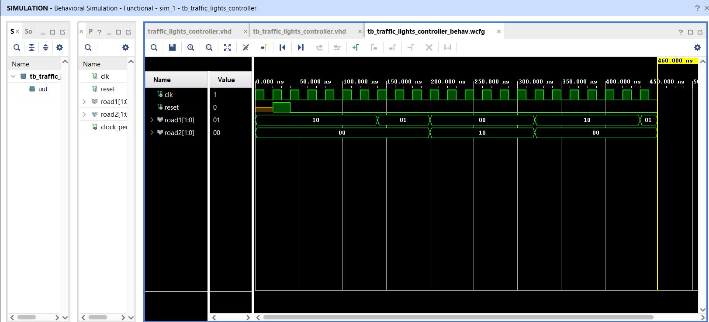

# TRAFFIC LIGHTS CONTROLLER DESIGN WITH FPGA
Traffic Light Controller Design with FPGA ( VHDL )

Design a traffic light control system, simulating the logic used in real-world traffic systems.

The traffic light controller I designed is a VHDL code that controls two traffic lights: one for the main road (ROAD1) and one for the secondary road (ROAD2). The aim is to ensure their synchronized operation. To test the structure I designed, I wrote a sample test bench and performed the testing. You can take it as an example and extend it to control three or more traffic lights.



TEST BENCH:

```


library IEEE;
use IEEE.STD_LOGIC_1164.ALL;

entity tb_traffic_lights_controller is
--  Port ( );
end tb_traffic_lights_controller;

architecture Behavioral of tb_traffic_lights_controller is

component traffic_lights_controller is

		port    (
						--inputs
					clk    : in std_logic;
					reset  : in std_logic;
						-- outputs
						
					road1 : out std_logic_vector(1 downto 0);
					road2 : out std_logic_vector(1 downto 0)
	
				);

end component;

signal clk : std_logic;
signal reset : std_logic;
signal road1 : std_logic_vector ( 1 downto 0 );
signal road2 : std_logic_vector ( 1 downto 0 );

constant clock_period : time := 20 ns;

begin

uut : traffic_lights_controller
    port map (
    
                    clk => clk,
                    reset => reset,
                    road1 => road1,
                    road2 => road2

              );

-- generate clock signal

clock : process
begin
        clk <= '1';
        wait for clock_period/2;
        clk <= '0';
        wait for clock_period/2;
end process;


stim : process
begin

    wait for 20 ns;   
    reset <= '1';
    wait for 20 ns;
    reset <= '0';
    wait for 100 ms;
    wait;
end process;

end Behavioral;


```
