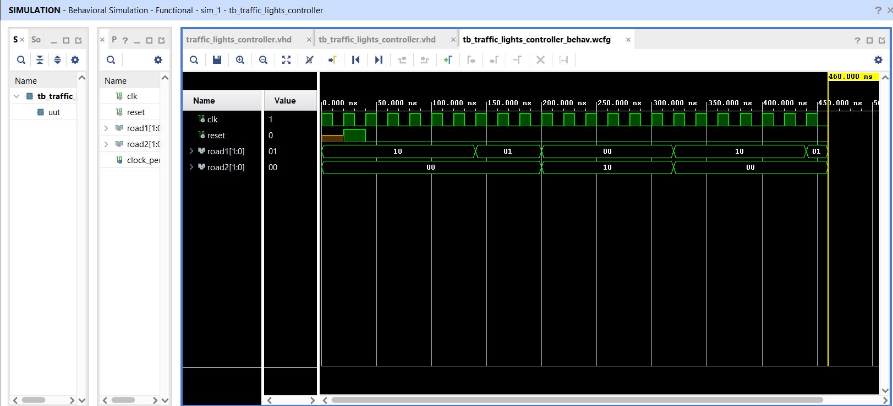

# TRAFFIC LIGHTS CONTROLLER DESIGN WITH FPGA
Traffic Light Controller Design with FPGA ( VHDL )

Design a traffic light control system, simulating the logic used in real-world traffic systems.

The traffic light controller I designed is a VHDL code that controls two traffic lights: one for the main road (ROAD1) and one for the secondary road (ROAD2). The aim is to ensure their synchronized operation. To test the structure I designed, I wrote a sample test bench and performed the testing. You can take it as an example and extend it to control three or more traffic lights.

